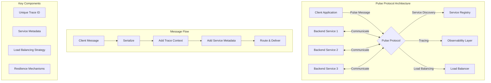
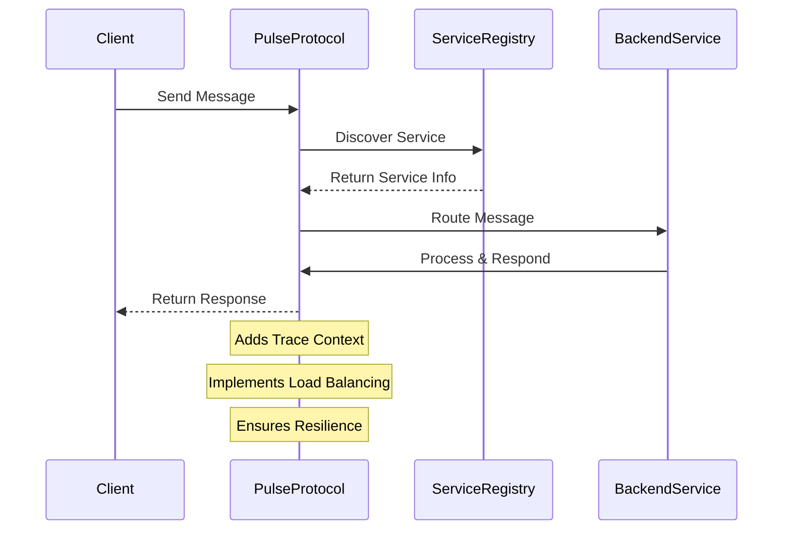

```mermaid
flowchart TB
    subgraph "Pulse Protocol Architecture"
        A[Client Application] -->|Pulse Message| B{Pulse Protocol}
        B -->|Service Discovery| C[Service Registry]
        B -->|Tracing| D[Observability Layer]
        B -->|Load Balancing| E[Load Balancer]

        F[Backend Service 1] <-->|Communicate| B
        G[Backend Service 2] <-->|Communicate| B
        H[Backend Service 3] <-->|Communicate| B
    end

    subgraph "Message Flow"
        M1[Client Message] --> M2[Serialize]
        M2 --> M3[Add Trace Context]
        M3 --> M4[Add Service Metadata]
        M4 --> M5[Route & Deliver]
    end

    subgraph "Key Components"
        SC1[Unique Trace ID]
        SC2[Service Metadata]
        SC3[Load Balancing Strategy]
        SC4[Resilience Mechanisms]
    end
```

```mermaid
sequenceDiagram
    participant Client
    participant PulseProtocol
    participant ServiceRegistry
    participant BackendService

    Client->>PulseProtocol: Send Message
    PulseProtocol->>ServiceRegistry: Discover Service
    ServiceRegistry-->>PulseProtocol: Return Service Info

    PulseProtocol->>BackendService: Route Message
    BackendService->>PulseProtocol: Process & Respond

    PulseProtocol-->>Client: Return Response

    Note over PulseProtocol: Adds Trace Context
    Note over PulseProtocol: Implements Load Balancing
    Note over PulseProtocol: Ensures Resilience
```
